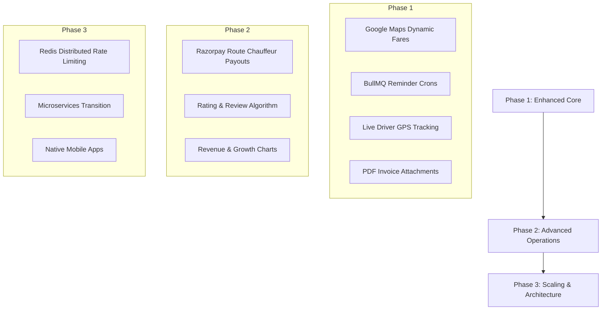

# DMS Luxe - Luxury Chauffeur Reservation Platform

DMS Luxe is a premium, high-end chauffeur reservation platform designed to offer passengers an elite booking experience. Users can reserve vehicles from a curated luxury fleet (including executive sedans and SUVs), manage their trips through a dedicated command dashboard, process payments securely, and receive automatic digital invoices. The system also supports driver profiles, admin-mediated chauffeur approvals, and live dispatching of pending rides to approved drivers.

---

## 🏗️ Tech Stack

### Frontend
- **Core:** React (Vite-powered for performance)
- **Styling:** Tailwind CSS (Custom luxury tokens, glassmorphism, responsive designs)
- **Animations:** Framer Motion (Transitions, scroll triggers, micro-animations)
- **Routing:** React Router DOM (Dynamic nested routing, protected routes)

### Backend
- **Core:** Node.js, Express.js
- **Real-Time Communications:** Socket.IO (Server-side broadcast dispatching)
- **Database:** MongoDB Atlas (Mongoose ODM)
- **Security:** JWT (JSON Web Tokens), bcryptjs (Hashing), Rate Limiting
- **Mailing:** Nodemailer (SMTP integration for invoicing)
- **Payment Gateway:** Razorpay Standard Checkout

---

## 🌟 Key Features

### 1. Landing Page & Visual System
- **Luxury Theme:** Gold accents (`#d4af37`), deep dark blue background (`#060a11`), sleek typography, and premium image placements.
- **Dynamic Services Grid:** Shows 2 services on mobile/tablet viewports with a progressive "Show More Services" disclosure, while rendering all 8 items in a clean 4-column layout on desktop viewports.
- **Responsive Navigation:** Hamburger dropdown drawer using `AnimatePresence` for smooth opening/closing, optimized for small, medium, and large displays.
- **Fleet Showcase Carousel:** Smooth touch swipe horizontal scrolling with title wrapping safeties and navigation arrows hidden on smaller viewports.

### 2. Authentication & User Management
- **Role-Based Routing:** Dedicated paths and experiences for **Clients**, **Drivers (Chauffeurs)**, and **Admins**.
- **Secure Sessions:** Stored in LocalStorage/Cookies via React's `AuthContext.jsx`.
- **Edit Profile:** Dynamic modal overlay allowing clients to modify personal details, upload profile photos, and change settings.
- **Chauffeur Verification Pipeline:** Drivers can upload license details and registration documents (RC), which must be checked and approved by an Admin before the driver receives ride dispatch alerts.

### 3. Multi-Step Booking Funnel
- **Step 1: Route Selection:** Input pickup and dropoff coordinates/addresses.
- **Step 2: Vehicle Selection:** Visual listing of luxury car models, categorizing premium pricing.
- **Step 3: Details:** Finalize scheduling time, guest information, and special comments.
- **Step 4: Payment:** Seamless integration with Razorpay Checkout API.

### 4. Interactive Command Dashboards
- **Client Dashboard:** Upcoming booking status, Address Book management, profile summary, and loyalty metrics. Horizontal scroll preservation prevents tabular records from compressing on narrow screens.
- **Driver Dashboard:** View available broadcasts for active rides, handle navigation maps, accept pending trips, and review past earnings.
- **Admin Dashboard:** Approve/reject chauffeur onboardings, manage fleet details, monitor platform-wide bookings, and review revenue statistics.

### 5. Automated Transaction Invoicing
- **Nodemailer SMTP:** Generates a custom HTML invoice immediately upon cash reservation creation or successful Razorpay verification.
- **Verification Engine:** Uses HMAC SHA-256 validation to compare signature tokens and guard against transaction tampering.

---

## 📁 Repository Structure

```
dms-cab-service/
├── backend/
│   ├── config/             # DB and gateway connections
│   ├── controllers/        # Route controllers (Auth, Bookings, Payments)
│   ├── middleware/         # Auth guards, security limits, CORS configurations
│   ├── models/             # Mongoose schemas (User, Ride, Vehicle)
│   ├── routes/             # API routes
│   ├── utils/              # Helper utilities (Email engine, custom errors)
│   ├── server.js           # Server runner
│   ├── app.js              # Express app initialization
│   └── package.json
│
├── frontend/
│   ├── src/
│   │   ├── components/     # UI components (Navbar, Footer, Services, Fleet snap)
│   │   ├── context/        # React Auth State Provider
│   │   ├── pages/          # Pages (Home, Fleet, Services, Dashboards, Booking Wizard)
│   │   ├── utils/          # Icons list and helpers
│   │   ├── App.jsx         # App routes & Global Scroll manager
│   │   ├── main.jsx        # App entry point
│   │   └── index.css       # Core Tailwind directives & layout tokens
│   ├── package.json
│   └── vite.config.js
│
├── .gitignore              # Root git ignore patterns
└── README.md               # Documentation (This file)
```
## 🚀 Getting Started

### 1. Prerequisite Installations
- **Node.js** (v18.0.0 or higher recommended)
- **npm** (v9.0.0 or higher)

### 2. Backend Setup
```bash
cd backend
npm install
npm run dev     # Launches dev server on http://localhost:5000
```

### 3. Frontend Setup
```bash
cd frontend
npm install
npm run dev     # Launches Vite dev server on http://localhost:5173
```

---

## 🛡️ Production & Security Best Practices

- **Strict JWT Guards:** Token verification handles auth validation checks securely on both cookie and authorization header configurations.
- **Granular Throttling:** Brute-force protections on signups/logins and carding-fraud rate limit protection on payment processing endpoints.
- **Data Integrity:** Strict Mongoose validations prevent database injections or data formatting bugs.
- **Scroll Safeties:** Custom React Scroll-to-Top triggers inside the root Router reset viewport positions to (0,0) on navigation transitions or smooth-scroll on active header link clicks.

---

## 🗺️ Future Architecture Roadmap



### Phase 1: Enhanced Core Features
1. **Dynamic Distance Fares:** Incorporate Google Maps Distance Matrix API to dynamically scale pricing based on exact route distances.
2. **Scheduled Ride Reminders:** Use BullMQ to enqueue automatic reminders (SMS/Email) sent 2 hours before reservation times.
3. **Live GPS Routing:** Stream driver coordinates to client dashboards using browser geolocation APIs over Socket.IO connections.

### Phase 2: Operational Enhancements
1. **Direct Chauffeur Splits:** Split payments dynamically using Razorpay Route to commission fees and send driver shares directly.
2. **Double-Blind Reviews:** Allow mutual rating (1-5 stars) to prioritize bookings to top-performing drivers first.

### Phase 3: High-Scale Architecture
1. **Redis Caching Layer:** Store transient data like driver positions and rate limiter counters in Redis to optimize database read cycles.
2. **Microservices Separation:** Decouple codebase into separate microservices (`Auth-Service`, `Booking-Service`, `Payment-Service`, `Notification-Service`) communicating via message brokers like RabbitMQ or Apache Kafka.
